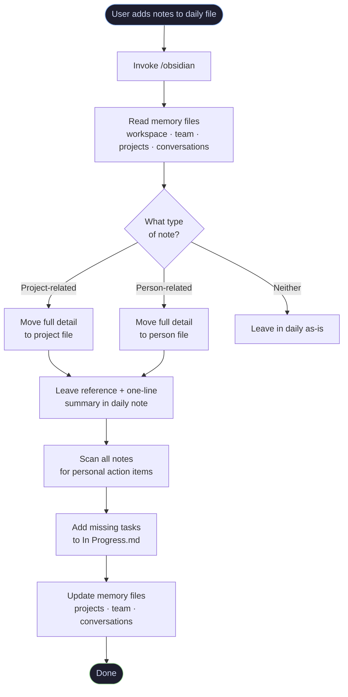

# Obsidian Notes Skill

A Claude Code skill for processing, organizing, and maintaining an Obsidian vault. Captures notes in daily files and intelligently routes them to the right project or person file, keeps a task list up to date, and maintains persistent memory across sessions.

---

## Workflow



---

## What It Does

- **Routes notes out of daily files** — project notes go to `projects/`, person notes go to `people/team/`, everything else stays in the daily
- **Keeps daily notes clean** — replaces moved content with a `→ [[link#heading]]` and a one-line summary
- **Deep links to context** — date sections in project files use `##` headings so daily references anchor directly to the right place
- **Tracks your tasks** — scans all processed notes for personal action items and adds them to `tasks/In Progress.md`
- **Persists memory across sessions** — reads and updates structured memory files so context carries over without re-explaining your vault
- **Soft deletes** — moves files to `trash/` instead of permanently deleting them

---

## Installation

1. Copy `skill.md` to your Claude Code commands folder:

```bash
cp skill.md ~/.claude/commands/obsidian.md
```

2. Replace `$VAULT_PATH` in the file with the absolute path to your Obsidian vault:

```bash
VAULT_PATH="/Users/yourname/Documents/Obsidian Vault"
sed -i '' "s|\$VAULT_PATH|$VAULT_PATH|g" ~/.claude/commands/obsidian.md
```

3. Create the required folders in your vault if they don't exist:

```bash
mkdir -p "$VAULT_PATH/projects"
mkdir -p "$VAULT_PATH/people/team"
mkdir -p "$VAULT_PATH/tasks"
mkdir -p "$VAULT_PATH/memory"
mkdir -p "$VAULT_PATH/trash"
```

4. Create your memory files (start with empty stubs):

```bash
for f in workspace team projects conversations; do
  touch "$VAULT_PATH/memory/$f.md"
done
```

---

## Auto-Invoke (Optional)

To have the skill load automatically whenever you mention notes, add this to your `~/.claude/CLAUDE.md`:

```markdown
## Obsidian Notes Skill
Whenever I mention taking, capturing, retrieving, or processing notes,
invoke the /obsidian skill before doing anything else.
```

---

## Configuration

Edit `~/.claude/commands/obsidian.md` to customize:

| Section | What to change |
|---|---|
| Memory files | Add or remove files from the read list at the top |
| `people/team/` | Change the folder name or who gets a dedicated file |
| Wikilink rules | Adjust which people get `[[linked]]` vs plain text |
| Style | Add project-specific conventions |

---

## Vault Structure Expected

```
your-vault/
├── daily/
│   └── YYYY-MM-DD.md
├── projects/
│   └── Project Name.md
├── people/
│   └── team/
│       └── Person.md
├── tasks/
│   └── In Progress.md
├── memory/
│   ├── workspace.md
│   ├── team.md
│   ├── projects.md
│   └── conversations.md
└── trash/
```

---

## Daily Note Format

```markdown
create date: 2026-03-09
update date: 2026-03-09

# 2026-03-09 — Monday

## [[Project Name]] - Standup
→ [[projects/Project Name#3/9/26]]
Brief summary of what was captured

## [[Person Name]] - Sync
→ [[people/team/Person Name#3/9/26]]
Brief summary of what was discussed
```

---

## Project File Format

```markdown
create date: 2026-01-01
update date: 2026-03-09

## 3/9/26

**You**
- task or note

**[[Teammate]]**
- their update

## 2/15/26

older notes...
```

---

## Related

- [kepano/obsidian-skills](https://github.com/kepano/obsidian-skills) — agent skills spec for Obsidian
- [pablo-mano/Obsidian-CLI-skill](https://github.com/pablo-mano/Obsidian-CLI-skill) — Obsidian CLI integration for lower-level vault operations
